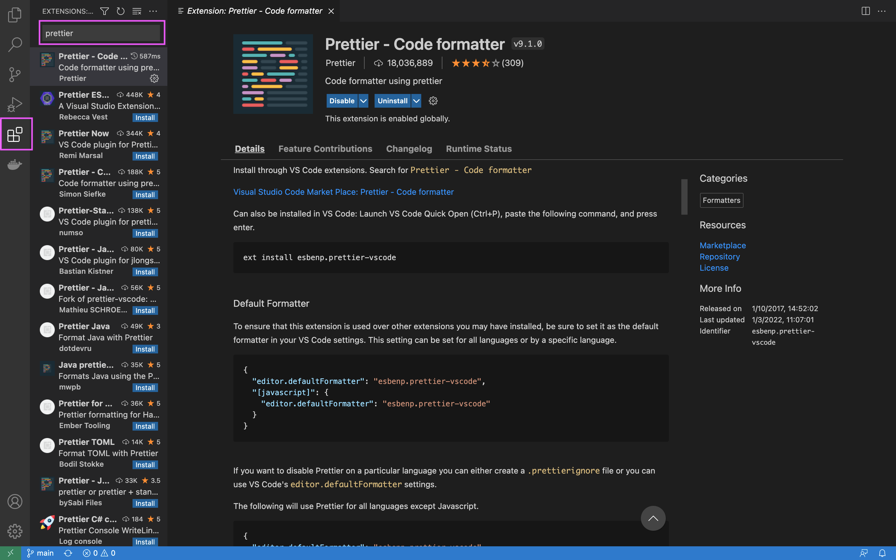

# Prettier

1. Install the `Prettier - Code formatter` extension
2. Update settings to automatically format on save:

- Use `Command + ,` on Mac to open the settings menu
- Or `Control + ,` on Windows
- Then search for `Editor: Format on Save` and make sure it is checked

Now whenever you save your files, it will automatically format your document!

Click [here](https://www.digitalocean.com/community/tutorials/code-formatting-with-prettier-in-visual-studio-code) for more details.

Before: inconsistent use of single/double quotes, missing semi-colons, inconsistent spacing

```
const firstName = "Jane"
const person = {first: firstName
}

console.log(person);

function sayHello(person) {
console.log(`Hello ${person.first}`)
}

sayHello({first: 'Sally'});
```

After: adds missing semi-colons, fixes spacing, quotes, etc.

```
const firstName = "Jane";
const person = { first: firstName };

console.log(person);

function sayHello(person) {
  console.log(`Hello ${person.first}`);
}

sayHello({ first: "Sally" });
```


